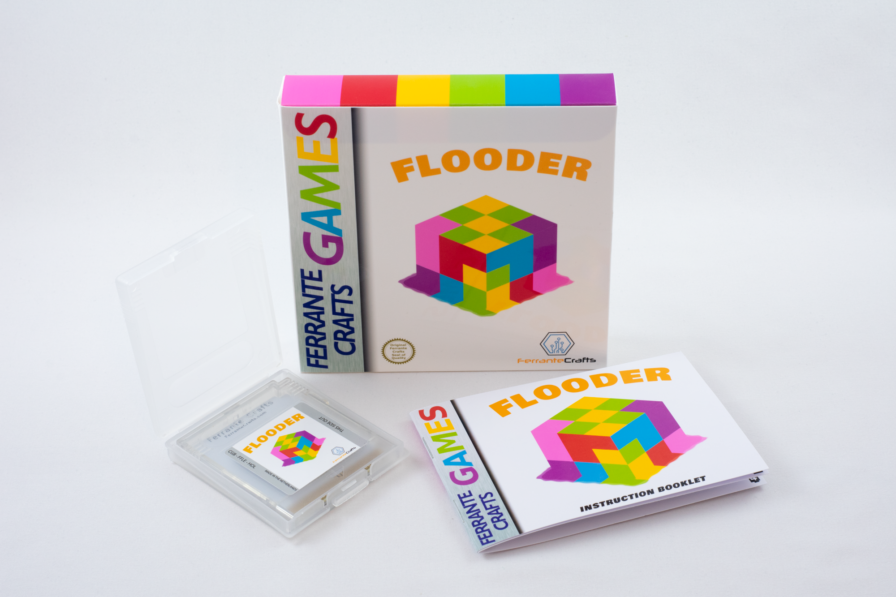

# Flooder
A puzzle game that works in original Nintendo Game Boy Color hardware.

The physical release is out now, [order here](https://www.ferrantecrafts.com/listing/1173804126/flooder-game-cartridge-for-game-boy).



## Quick start

First, you need to install [GBDK 2020](https://github.com/gbdk-2020/gbdk-2020/releases).

Open the terminal and navigate to the src folder, then run the following command to generate the ROM file:
```sh
lcc -Wm-yC -o flooder.gb main.c
```

## Disclaimer
I'm not affiliated with Nintendo in any way.
Game Boy® is a registered trademark by Nintendo. Nintendo® is a registered trademark.
